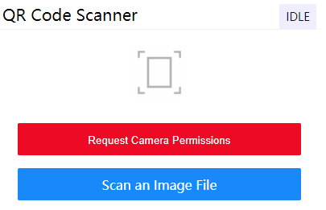
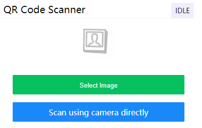

# Html5-QRCode-CSS 
A css theme for html5-qrcode.

|  | |
| -- | -- |

## How to use?
> For example code [read index.html](https://github.com/Qiming-Liu/html5-qrcode-css/blob/main/index.html).  

1. Add `html5-qrcode-css.css` in your web page. 
```html
<link rel="stylesheet" href="./html5-qrcode-css.css">
```
2. Add `jquery.js` and `html5-qrcode.js` in your web page (required). 
```html
<script src="https://cdnjs.cloudflare.com/ajax/libs/jquery/3.6.0/jquery.slim.js"></script>
<script src="https://cdnjs.cloudflare.com/ajax/libs/html5-qrcode/2.0.1/html5-qrcode.min.js"></script>
```
3. Setup Html5QrcodeScanner
```html
<div id="reader"></div>
```
```js
new Html5QrcodeScanner("reader", { fps: 10, qrbox: 250 }, /* verbose= */ false);
```
4. Add `html5-qrcode-css.js` in your web page. 
```html
<script src="./html5-qrcode-css.js"></script>
```
